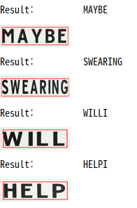

## keras-OCR   
- using keras_ocr Detector class
- Recognition model : CRNN architecture
- dataset :  **[MJ Synth](https://www.robots.ox.ac.uk/~vgg/data/text/)**

문자가 포함된 input image가 주어지면 문자를 detection하고 recognition하는 과정을 진행해 보겠습니다.   

input image에 대한 Detector & recognition은 다음과 같습니다.

## Original image

 

---

 

## Image detection

- Original image에서  문자 부부만 따로 detection을 해줍니다.  
- detection 부분의 시각화를 위해 PIL에 ImageDraw.Draw를 사용해서 빨간색 box를 그립니다.

 

---

 

## Image recognition

- text detection된 이미지를 recognition 합니다.

- 완변하게 글자 인식이 되진 않았지만 거의 대부분의 문자를 인식하는데 성공했습니다.  
